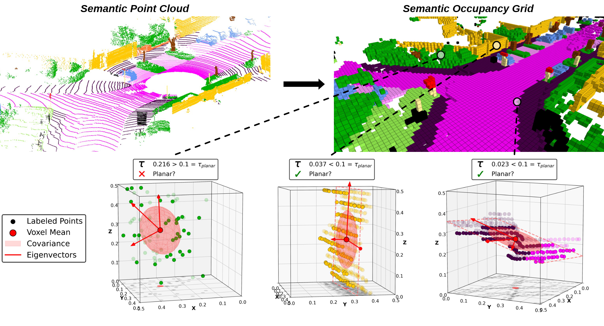
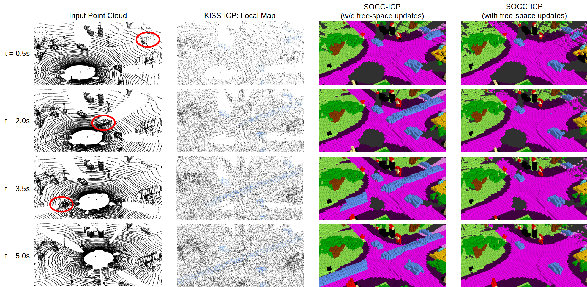

<div align="center">

# SOCC-ICP: Semantics-Assisted Odometry Based on Occupancy Grids and ICP

<a href="https://github.com/josch14/socc_icp/tree/main/src/socc_icp"></a>
<a href="https://github.com/josch14/socc_icp"></a>
<a href="https://github.com/josch14/socc_icp/blob/main/LICENSE"></a>
<a href="https://arxiv.org/abs/2605.15074"></a>
<a href="https://ieeexplore.ieee.org/document/11543211"></a>
<a href="https://github.com/josch14/socc_icp/pkgs/container/socc_icp"></a>

</div>

**Abstract:** Reliable pose estimation in previously unseen environments is a fundamental capability of autonomous systems. Existing LiDAR odometry methods typically employ point-, surfel-, or NDT-based map representations, which are distinct from the semantic occupancy grids commonly used for downstream tasks such as motion planning. We introduce SOCC-ICP, a semantics-assisted odometry framework that jointly performs Semantic OCCupancy grid mapping and LiDAR scan alignment. Each map voxel encodes geometric and semantic statistics, enabling adaptive point-to-point or point-to-plane ICP based on local planarity. Further, the occupancy grid naturally filters dynamic objects through raycasting-based free-space updates. Across diverse evaluation scenarios, SOCC-ICP achieves performance competitive with state-of-the-art LiDAR odometry and remains robust in geometrically degenerate environments, even in the absence of semantic cues. When semantic labels are available, integrating them into map construction, downsampling, and correspondence weighting yields further accuracy gains. By unifying odometry and semantic occupancy grid mapping within a single representation, SOCC-ICP eliminates redundant map structures and directly provides a map suitable for downstream robotic applications.





## 📖 Overview

SOCC-ICP is implemented on ROS2 Humble, with [Radix](https://github.com/ProjectVERUM/radix_ros2_pkg) handling semantic occupancy grid mapping in a separate node and scan registration currently performed in Python. The current system is a proof of concept and is not optimized for efficiency. This repository is intended as an accessible and easily adaptable codebase for reproducing the results reported in the paper. A production-ready implementation is not provided 🤖💭 The main performance bottlenecks are:
- **Python scan registration**: a native C++ implementation would significantly reduce per-frame processing time
- **ROS2 communication overhead**: the split between Radix (mapping) and the registration node introduces serialization and transport costs that a unified implementation would avoid
- **Algorithmic headroom**: further optimizations on both the mapping and registration side are possible and left for future work

This repository contains the scan registration module as described in the paper. The semantic occupancy grid mapping side is handled by the [radix_ros2_pkg](https://github.com/ProjectVERUM/radix_ros2_pkg) submodule and its companions, included here as git submodules under `src/`.

## 🗒️ Open TODOs

- [ ] Add docker pull option for pre-built image (see radix package)
- [ ] Add evaluation instructions


## 📦 Dataset Preparation

Instructions for downloading and preparing each dataset used in the paper (KITTI, MulRan, Newer College, Ground-Challenge, SubT-MRS) are provided in [DATASETS.md](DATASETS.md).


## 🚀 Getting Started

Clone the repository with all submodules:
```bash
git clone --recurse-submodules https://github.com/josch14/socc_icp.git
cd socc_icp
```

**Option A — Docker (recommended):** avoids manual dependency management and environment issues. Pull the pre-built image from GHCR, or build it locally. Afterwards, mount the dataset and run. 

Pre-built image
```bash
docker pull ghcr.io/josch14/socc_icp:latest
docker run -it --rm -v /path/to/kitti_dataset:/home/kitti_dataset ghcr.io/josch14/socc_icp:latest bash
```

Local build 
```bash
docker build -t socc_icp .
docker run -it --rm -v /path/to/kitti_dataset:/home/kitti_dataset socc_icp bash
```


**Option B — Local installation:** see [INSTALLATION.md](INSTALLATION.md) for step-by-step instructions.


## ▶️ Usage

From `src/socc_icp/`:
```bash
cd src/socc_icp/
```

**KITTI** (with / without semantics), uses the default Radix config (as used to produce paper results):
```bash
python -m run.run_kitti
python -m run.run_kitti --no-semantics
```

**MulRan:**
Note: The paper results were produced with $p^{miss} = 0.475$ set in Radix.
```bash
python -m run.run_mulran
```

**Newer College:**
```bash
python -m run.run_newer_college
```

**Ground Challenge:**
Note: The paper results were produced with a voxel size of 0.2 m and $p^{miss} = 0.485$ set in Radix.
```bash
python -m run.run_ground_challenge
```

**SubT-MRS:**
Note: The paper results were produced with a voxel size of 0.2 m and $p^{miss} = 0.485$ set in Radix.
```bash
python -m run.run_subt_mrs
```
Note: The SubT-MRS ground truth only covers roughly half of the scans; the remaining frames are filled with zero poses as placeholders. Before evaluation, run the following script to filter out those invalid frames from the output:
```bash
python -m scripts.fix_subt_mrs
```


## 📊 Paper Results

The SOCC-ICP logs for all datasets are provided in [`logs_paper/`](logs_paper/), serving two purposes: verification of reported metrics and evaluation documentation. The logs are not tracked in git, download them from the [v0.1.0 release assets](https://github.com/josch14/socc_icp/releases/tag/v0.1.0).

See [`logs_paper/README.md`](logs_paper/README.md) for details.


## 🙏 Acknowledgements

This work builds on [KISS-ICP](https://github.com/PRBonn/kiss-icp) and [GenZ-ICP](https://github.com/cocel-postech/genz-icp), as well as [Bonxai](https://github.com/facontidavide/Bonxai). Without their foundational contributions SOCC-ICP would not have been possible!


## 📬 Contact

For questions or feedback, feel free to [open an issue](https://github.com/josch14/socc_icp/issues) or reach out via johannes.scherer.ivi@outlook.com


## 📝 Citation

If you find this work useful, please cite ([IEEE Xplore](https://ieeexplore.ieee.org/document/11543211) | [arXiv](https://arxiv.org/abs/2605.15074)):
```bibtex
@ARTICLE{scherer2026soccicp,
  author={Scherer, Johannes and Hirt, Sebastian and Meeß, Henri},
  journal={IEEE Robotics and Automation Letters}, 
  title={SOCC-ICP: Semantics-Assisted Odometry Based on Occupancy Grids and ICP}, 
  year={2026},
  volume={11},
  number={7},
  pages={8616-8623},
  keywords={Iterative closest point algorithm;Odometry;Laser radar;Labeling;Clouds;Sequences;Sequential analysis;Grounding;Simultaneous localization and mapping;Conferences;Mapping;localization;SLAM},
  doi={10.1109/LRA.2026.3699259}}
```
